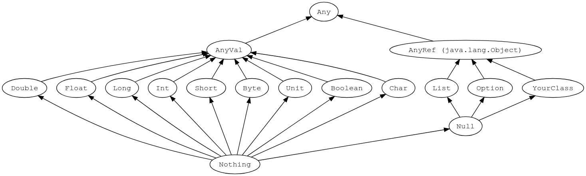

## Лекция 2

##### Что происходит в получившейся реализации, если в программе есть рекурсивный тип?
В текущей реализации используется регулярная унификация на основе union-find солвера (`src/tip/solvers/UnionFindSolver.scala`). Она разрешает использовать рекурсивные термы, в отличие от линейного алгоритма унификации. В итоге программа будет типизированна с использованием μ-нотации. Пример (`examples/rectype.tip`):

Исходная программа:

```
main() {
    var p;
    p = alloc null;
    *p=p;
    return 0;
}
```

Выведенные типы:

```
Inferred types:
  0[5:12] = int
  null[3:15] = ⭡x7
  main(){...}:1:1 = () -> x5
  p[2:9] = ⭡μx6.⭡x6
  alloc null[3:9] = ⭡μx6.⭡x6
```

##### Что будет, если в нашу систему ввести тип Bool?
Изменившиеся правила:
1. E_1 == E_2 <=> [[E_1]] == [[E_2]] /\ [[E_1 == E_2]] == Bool
2. if (E) ... <=> [[E]] == Bool
3. while (E) ... <=> [[E]] == Bool

Precision не изменится, т.к. мы по-прежнему будем пускать только корректные программы.
Recall ухудшится, т.к. перестанут проходить корректные семантически программы (число slack'ов увеличится). Пример: 

```
int x = 1;
if (x) ...
```

не пропустит тайпчекер, хотя мог бы (точно знаем, что должны войти в `if`).

##### Что будет, если в нашу систему ввести тип Array?
Вводим Array с типовым параметром alpha (обозначим как Array<alpha>)
Изменившиеся правила:
1. X[E_1] op E_2 <=> [[ X[E_1] ]] == [[E]] /\ [[E_1]] == int /\ [[X]] == Array<[[E_1]]>
2. X = {X_1, X_2, ..., X_N} <=> forall i, j: [[X_i]] == [[X_j]] /\ [[X]] Array<[[X_i]]>
3. A[E] <=> [[E]] == int /\ [[A]] == Array<alpha> /\ [[ A[E] ]] == alpha
4. {} <=> [[ {} ]] == Array<alpha>

Типизированная программа:

```
main() {
    var x, y, z, t;
    x = {2, 4, 8, 16, 32, 64};    // [[x]] == Array<Int>
    y = x[x[3]];                  // [[y]] == Int
    z = {{}, x};                  // [[z]] == Array<Array<Int>>
    t = z[1];                     // [[t]] == Array<Int>
    t[2] = y;
}
```

## Лекция 3

##### Можно ли выразить анализ типов с предыдущей лекции как анализ над решетками?
Да, можно, например, в виде плоской решётки. Тогда в ней Top -- типовая переменная (любой тип, аналог ответа "`?`" для знаков), Bottom -- ошибка типизации (`null` как ключевое слово языка типизируется отдельно), все остальные типы между. Для более продвинутой решётки потребуется вводить отношение подтипизации, которого в языке нет (по крайней мере на момент 2-й лекции).

##### Можно ли выразить анализ над решетками как анализ типов?
(насколько я понимаю, речь не про TIP) Да, можно, введя subtyping как отношение между элементами, `Any` (`Object`, etc) как Top, `Nothing` (`Nil`, etc) -- как Bottom. Не все системы типов выразимы в таком случае, например, C++. Система типов Scala 3, напротив (вроде бы), выразима таким образом. Вот её подмножество: 


## Лекция 4

##### Какова сложность структурного алгоритма? (для liveness analysis)
(пусть `n` -- число узлов CFG, `k` -- количество переменных)
Структурный алгоритм:
- Изначально в очереди O(`n`) итераций за каждый узел CFG (точнее даже просто `n`)
- Проходим один узел CFG за итерацию
- Шаг `y = f_i (x1, x2, ..., xn)` (работа функции системы ограничений): O(`n*k`) шагов:
  - за `JOIN(n) ∪ vars(n)`
- После шага `WL ← WL ∪ deps(v_i)` потенциально число операций может увеличиться на O(`n`) максимум (если в языке есть pattern-matching, иначе вообще на O(1))

Итого O(`n*n*k`)

##### А если в CFG нет циклов?
Базовый анализ с предыдущего пункта никак не учитывал циклы, `JOIN` и `vars` не зависят от циклов, поэтому они не должны влиять на итоговый результат

##### Какова сложность по памяти?
На каждом конкретном шаге необходимо хранить состояние следующих O(`n`) узлов-последователей и O(`k`) переменных, итого O(`n`) + O(`k`) 


## Лекция 5
Допустим, мы хотим реализовать оптимизирующий компилятор для языка TIP. Среди прочего, для работы ему требуется информация о размерах различных переменных.
- bool (1 bit)
- byte (8 bit signed)
- char (16 bit unsigned)
- int (32 bit signed)
- bigint (any integer)
- any (any thing)

`(T) E` — операция приведения типов

##### Предложите решетку для реализации анализа размера переменных
*Note: Нужно описать не только решетку для одного абстрактного значения, но и все другие решетки, требуемые для анализа целой программы*

Воспользуемся существующей решеткой для интервального анализа, но все интервалы будут представлять собой краевые значения типов, описанных в условии: [0, 1] для Bool, etc. Соответственно будет переиспользована и решетка из переменных в их интервалы. Для более удобного представления типов можно пост-обработать результаты функцией, переводящей конкретные значения в границах интервалов в биты размера. 

##### Опишите правила вычисления различных выражений
Правила вычислений остаются такими же: `eval(σ, INT) = [INT, INT]`, etc., поскольку мы просто переиспользовали уже существующий анализ по-максимуму.

Если бы мы сделали решётку сразу по размеру числа, пришлось бы переделывать eval не тривиальным образом. Например, не совсем понятно, что делать со сложением двух интервалов: переходит ли правая граница получившегося интервала в следующий разряд или нет. Удобнее всего не работать с такой решеткой сразу, а пост-обрабатывать результат до битов.

##### Придумайте нетривиальный пример программы на TIP для получившегося анализа и посмотрите, что для него получается

```
main() {
    var x,y;
    x = 100; // [100, 100]
    y = 10000; // [10000, 10000]
    while (input) {
        x = 7;   // [7, 7]
        x = x+1; // [8, 8]
        y = y+1; // [128, +inf], because 128 is largest power of 2 less than 10000
    }
    if (y > 12000) y = 2; // [2, 2]
    else y = y+1; // [128, +inf]
    return y; // [2, +inf]
}
```


## Лекция 5

##### Напишите вариант программы, для которой анализ открытости-закрытости файлов не показывает корректный результат даже с учётом всех возможных условий в переходах
Чтобы испортить результаты анализа, достаточно добавить в исходную программу к переменной `flag` зависимость от какой-нибудь ещё переменной, например:

```
if (x > 15) {
  open();
  flag = 1;
  // Здесь всё как обычно
} else {
  close();
  if (x == 5) {
    flag = 0;
  } else { 
    flag = 1;
  }
}

// (flag = 0) -> {close}, а про flag = 1 информации нет
if (flag) {
  close();
}
```

##### Предложите, каким образом можно решить описанные в лекции проблемы в этой ситуации
Исправить текущий анализ можно, добавив в анализ к `flag` зависимость по `x`. То есть, к правилам

```
[[assume(flag == 1)]] = JOIN(n)[(flag == 0) -> {}]
[[assume(flag == 0)]] = JOIN(n)[(flag == 1) -> {}]
[[flag = 1]] = JOIN(n)[(flag == 0) -> {}]
[[flag = 0]] = JOIN(n)[(flag == 1) -> {}]
```

добавить следующие:

```
[[if (x == 5)]] = JOIN(n)[flag = 0]
[[if (cond(x)]] = JOIN(n)[flag = 1] // Любое другое условие на x
```

Тогда анализ найдёт потенциальную ошибку:

```
if (x > 15) {
  open();
  flag = 1;
  // (!(x == 5)) -> (flag = 1) -> {open}
} else {
  close();
  if (x == 5) {
    flag = 0; // (x == 5) -> (flag = 0) -> {closed}
  } else { 
    flag = 1; // (!(x == 5)) -> (flag = 1) -> {closed}
  }
}

// (!(x == 5)) -> (flag = 1) -> {open}
// (x == 5) -> (flag = 0) -> {closed}
// (!(x == 5)) -> (flag = 1) -> {closed}
if (flag) {
  close(); // В этой точке можем корректно порепортить ошибку
}
```